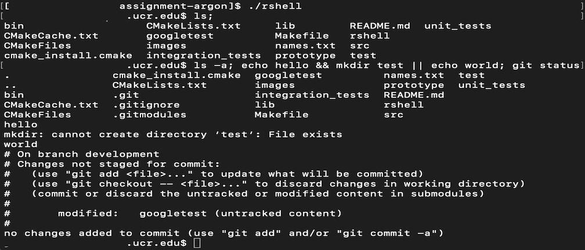
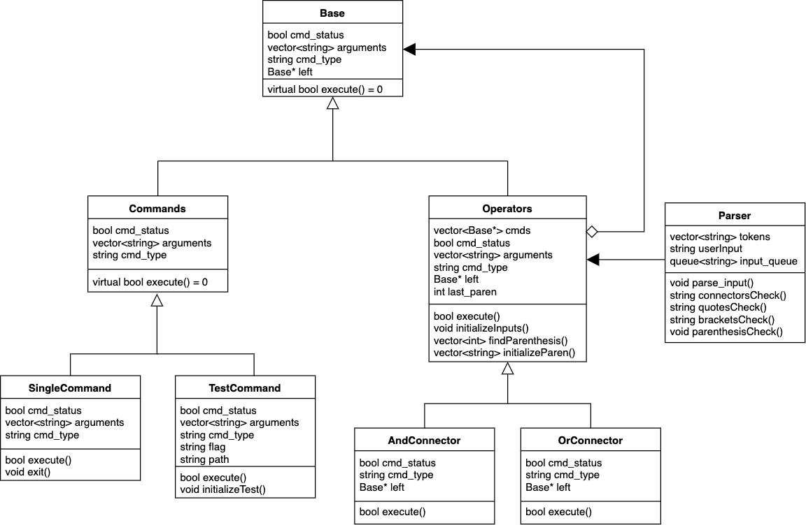

# C Shell Programming Project



# Introduction
This is an implementation of a Unix-like shell. RShell is able to ingest
user commands and execute them. Our current implementation of RShell
uses a Composite Design Pattern. 

### Installation
RShell can be installed using the `git clone` command:

```
$ git clone https://github.com/MustafaShams/C-Shell

$ git submodule init

$ git submodule update
```
### Getting Started

To build and execute RShell (in RShell's root directory):

```
$ cmake .

$ make

$ ./rshell
````

### Usage

RShell command format:

`$ executable [argumentList] [connector] [executable]...`

RShell is capable of utilizing various Unix shell executable commands:

 `ls` : Lists information about the files found within a directory.
 
 `echo` : Writes output to the standard output.
 
 `mkdir` : Creates directories.
 
 `exit` : Exits the RShell instance.
 
 These commands can also utilize options for increased functionality:
 
 `ls -a` : Shows all entries, including hidden files.
 
 `echo -n` : Does not append a newline.
 
 #### Connectors
 
 Connectors can also be utilized to chain commands (`&&, ||, ;`):
 
 `command1 && command2` : `command2` will only execute if, and only if,
 `command1` executes successful.
 
 `command1 || command2` : `command2` will only execute if, and only if,
 `command1` executes unsuccessfully.
 
 `command1; command2` : `command2` will execute after `command1` 
 regardless of execution status.
 
 Here's an example of chained commands with options included:
 
 `ls -al; mkdir test_dir || echo -n 'failed';`
 
 #### Test Files and Directories 
 
 RShell can also validate the existence of files or directories using 
 the `test` keyword or `[ ]` surrounding a valid command:
 
 `$ test -e root/test/file.txt`
 
 or 
 
 `$ [-e root/test/file.txt]`
 
 Flags:
 
 `-e` : Checks if a directory/file exists.
 
 `-f` : Checks if a directory/file exists and if it is a regular file. 
 
 `-d` : Checks if a directory/file exists and if it is a directory.
 
 If no flag is provided, `-e` is set by default.
 
 This functionality can also be utilized alongside connectors:
 
 `$ [-e root/test/file.txt] && ls; ech || echo this will print;`
 
 And even with precedence:
 
 `$ ([root/test/file.txt] && ls) || echo file doesn't exist;`
 
 #### Precedence
 
 RShell can also prioritize command execution with precedence. Here's an
 example of execution with precedence:
 
 `$ (echo a && echo b) || (echo c && echo d)`
 
 The expected output would be:
 
 `a`
 
 `b`
 
 Precedence can be utilized with all current functionality of RShell: 
 connectors, single commands, and tests.
 
 #### Note
 Some things to be aware of with RShell:
 
 `\t` : The tab character is considered whitespace.
 
 `Integration tests` : Should be run from within the `/integration_tests/`
 directory.
 
 `echo ( hey )` or `echo (hey)` : When using parenthesis in an `echo` statement, it will always return the output: `(hey)` with spaces removed after the first parenthesis and before the last parenthesis.  
 
# Diagram


# Classes
### Commands
The `Commands` class group is used to execute the user's input. `Commands`
inherits from the `Base` class and its subclasses implements their own 
flavor of the `execute` method.
 - `SingleCommand`
     
     - Is a class that handles executing commands using `execvp`. It has
     two functions:
        1. `execute` : Takes the user's input and runs it through 
        `execvp`, it returns true if it executes successfully or false 
        if it is unsuccessful.
        2. `exit` : Exits the RShell instance.
 - `TestCommand`
 
    - Is a class that handles testing the existence of files and 
    directories.
        1. `execute` : Takes the user's provided path and validates
        the file or directory with three flags:
            - `-e` : Checks if file/directory exists. It is set as the
            default flag.
            - `-f` : Checks if file/directory exists and if it is a
            regular file.
            - `-d` : Checks if file/directory exists and if it is a
            directory.
        2. `initializeTest` : Takes the user's input and sets the `flag`
        member if one is provided, otherwise it is set to `-e` by
        default.
       
 The `Commands` subclasses may be expanded as RShell's functionality 
 increases.
 
### Operators
The `Operators` class group is used to initialize commands and 
precedence and to execute connector logic.
- `Operators` 

    - Handles initialization of commands and sets up connectors.
    - If precedence is found in user's input, initializes the commands
    in their appropriate order. 
- `AndConnector`
    
    - Handles the logic for executing an `&&` command such as `ls && echo hey`
- `OrConnector` 

    - Handles the logic for executing an `||` command such as `mkdir test || echo world`
    
 
The `Operators` subclasses may be expanded as RShell's functionality increases.
### Parser
The `Parser` class is used to parse the user's input. It utilizes the 
`boost/tokenizer` library to separate user input into tokens. The 
delimitters used by Parser are `\t` and whitespaces. `Parser` also
identifies connectors (`&&, ||, ;`), tests (`[ ]`), and precedence 
(`( )`) from user input and relays that to the `Operators` class.

# Prototypes/Research
### Execute

This is RShell's current iteration of the `execute` method. This would
be found within `Valid Command` which would execute the user's input.
While this iteration is able to execute a single command, it is not
currently implemented to take in chained commands. This will be further
discussed in the Development Roadmap section.

```
bool execute(vector<char*> cmd) {
    auto pid = fork();

    if (pid < 0){
        perror("Fork issue.");
        exit(1);
    } else if (pid == 0) {
        if (execvp(cmd[0], cmd.data()) == -1){
            perror("Execvp failed.");
            exit(1);
        }
    } else {
        int status;
        pid = wait(&status);
        if (WIFEXITED(status)) {
            cout << "pid " << pid << " exited with status: " << status << endl;
        } else{
            cout << "pid " << pid << " exited abnormally." << endl;
        }
    }
    return true;
}
```

### Parse Input

After doing research into various avenues for parsing user's input, we 
have chosen the `boost/tokenizer` library. A rough prototype of RShell's
initial parsing system can be found below. Our current intention for the
 `Parser` class is to take the user input string and tokenize the string
 . This will allow the `Commands` class to identify what must be
 completed for a successful execution. This current iteration is not
without issues, which will be addressed in the Development Roadmap 
section. If changes are made, this document will be continually updated. 

```
void Parser::parse_input() {
    char_separator<char> sep(" \t", "#;&|");
    tokenizer< char_separator<char> > tok(getUserInput(), sep);
    queue<string> input_queue;

    for (auto &itr : tok) {
        input_queue.push(itr);
    }

    vector<string> input;

    while (true) {
        while (!input_queue.empty()) {
            input.push_back(input_queue.front());
            input_queue.pop();

        }

        if (input_queue.empty()) {
            setTokenVec(input);
            break;
        }
    }
}
```
# Development and Testing Roadmap

### Commands
The `Commands` class can be considered the motherboard of this system.
Because it is in charge of execution of the user's commands, it is
paramount that it is well tested. In its current iteration, the 
`Valid Command`'s `execute` method is able to execute a single command.
But, it may be more difficult to implement multiple command execution.
Another roadblock is the testing of the `Commands` class. The `execution`
method may rely on system calls, and that may cause testing to be
difficult. Once the unit testing baseline is created, some of the tests
that we will be implementing are: 

### Parser

The `Parser` class is just as vital to RShell as the `Commands` class 
and its subclasses. Because of this, it is extremely important that the
`parse_input` method is thoroughly tested and extensibility is possible.
Some of the test cases for `parse_input` are:
  

### Connector

The `Connector` class is a possible development implementation we are 
currently working on. We are trying to determine whether a `Connector` 
class is needed in order to figure out which commands to execute. Our 
`Parser` class seems to handle the issue of seperating the different calls
so this is something we are discussing. However, if we did have a `Connector` 
class it would contain these possible test cases :
 
*Note*: Here we use `AND` to represent `&&` and `OR` to represent `||`

### Test

The `Test` class is a new feature that must be implemented. It will be able to support a literal and
symbolic form for execution. Likewise, it will be able to be used in conjunction with previously
implemented features like connectors.


### Precedence

Precedence is a new feature that must be implemented. It will be used to grant priority 
for execution to commands within `( )`. Likewise, it will be able to be used in conjunction with previously
implemented features like connectors.
